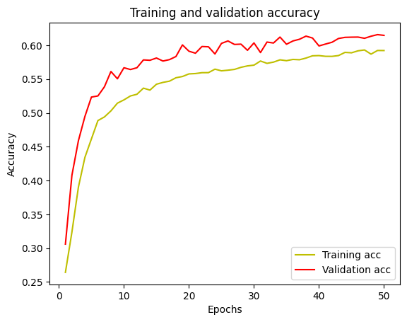

# Age, Gender and Emotion Detection
---
## About Dataset

UTKFace dataset is a large-scale face dataset with long age span (range from 0 to 116 years old). The dataset consists of over `20,000 face images` with annotations of **`age, gender, and ethnicity`**. The images cover large variation in pose, ***facial expression***, illumination, occlusion, resolution, etc. This dataset could be used on a variety of tasks, e.g., face detection, age estimation, age progression/regression, landmark localization, etc.

* [Original Dataset Website](https://susanqq.github.io/UTKFace/)
* [Kaggle Dataset](https://www.kaggle.com/datasets/jangedoo/utkface-new)

## This dataset is for facial expression
* [Fer2013 Facial Expression](https://www.kaggle.com/datasets/rkuo2000/fer2013)

> Note: For the facial expression dataset images resolution **48x48x1** grayscale and also splits two directories;
>1. Train: it contains `7 classes` and total of 28709 images
>2. Test: it contains `7 classes` and total of 7178 images
>> Here is the class labels:
>> * class_labels=`['Angry','Disgust', 'Fear', 'Happy','Neutral','Sad','Surprise']`

The counts of facial expression


---
For the Facial Expression, i made my own CNN model code example down below:
``` python
# Create the model
model = Sequential()

model.add(Conv2D(32, kernel_size=(3, 3), activation='relu', input_shape=(48,48,1)))

model.add(Conv2D(64, kernel_size=(3, 3), activation='relu'))
model.add(MaxPooling2D(pool_size=(2, 2)))
model.add(Dropout(0.1))

model.add(Conv2D(128, kernel_size=(3, 3), activation='relu'))
model.add(MaxPooling2D(pool_size=(2, 2)))
model.add(Dropout(0.1))

model.add(Conv2D(256, kernel_size=(3, 3), activation='relu'))
model.add(MaxPooling2D(pool_size=(2, 2)))
model.add(Dropout(0.1))

model.add(Flatten())
model.add(Dense(512, activation='relu'))
model.add(Dropout(0.2))

model.add(Dense(7, activation='softmax'))
```

And here is the output my CNN model


I used DELL Inspiron 15 7567 with the Geforce GTX 1050 graphic card and 8 GB ram.

> For the `cuda` version `11.2` and the `cudnn` version `8.1`
---


---



---

Here is the result with age, gender, and expression


---

## For the age and gender classification

### Data preprocessing
* Data I have downloaded is composed of `23,708 images` with age and gender in the Image Name. For Example, `1_0_0239389.JPG` image means that `age is 1, gender is 0 (male)` and `0 refers to the race (not needed in this task)`. So I split the image name on '_' so I can get separated age and gender with image. Also, I have shuffle all the images

```
age_labels, gender_labels, image_path = [], [], []

for filename in filenames:
    image_path.append(filename)
    temp = filename.split('_')
    age_labels.append(temp[0])
    gender_labels.append(temp[1])
```

> Then added to pandas Dataframe to split easier and splitted `25% testing` and `75% training`
>```
> df = pd.DataFrame()
> df['image'], df['age'], df['gender'] = image_path, age_labels, gender_labels
>
>train, test = train_test_split(df, test_size=0.25, random_state=42)
>```